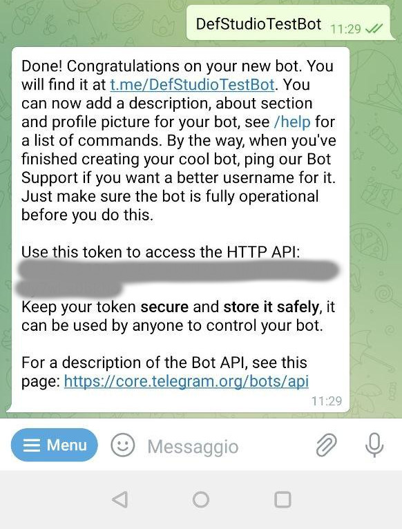
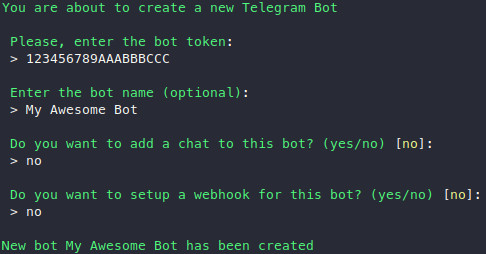
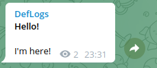

This tutorial walks through the happy path for a first bot: install Telegraph in a Laravel application, create a bot in BotFather, register it in Telegraph, open a webhook, handle the `/start` command, register a chat, and verify the behavior with a test without making real Telegram requests.

## Prerequisites

You need:

- A Laravel application on PHP `^8.2` with Illuminate/Laravel `^10.0`, `^11.0`, `^12.0`, or `^13.0`.
- A public HTTPS URL for the webhook. For local development, use a tunnel such as `ngrok`, `expose`, or a similar HTTPS endpoint.
- A Telegram account with access to [@BotFather](https://t.me/botfather).

Do not commit real bot tokens, webhook secret tokens, or dumps of incoming Telegram payloads. Store secrets in `.env` or in your environment's secret manager.

## 1. Install Telegraph

Install the package in the host Laravel app:

```shell
composer require defstudio/telegraph
```

Publish the config and migrations:

```shell
php artisan vendor:publish --tag="telegraph-config"
php artisan vendor:publish --tag="telegraph-migrations"
php artisan migrate
```

The order matters: publish config and migrations first, then run migrations in the host application.

Check the basic values in `.env`:

```dotenv
APP_URL=https://example.test
TELEGRAM_WEBHOOK_DOMAIN=https://example.test
TELEGRAPH_BOT_TOKEN=replace-with-botfather-token
TELEGRAPH_WEBHOOK_SECRET=replace-with-a-random-secret
```

`TELEGRAPH_BOT_TOKEN` is needed only if your application reads the token from config instead of the interactive `telegraph:new-bot` wizard. `TELEGRAM_WEBHOOK_DOMAIN` is needed when the webhook URL should use a different domain than `APP_URL`. Use `TELEGRAPH_WEBHOOK_SECRET` as the value for `--secret`, so Telegram sends it in the `X-Telegram-Bot-Api-Secret-Token` header; use a random string and do not publish it in logs.

If you create the bot programmatically, add the token to application config, for example in `config/services.php`:

```php
'telegram' => [
    'bot_token' => env('TELEGRAPH_BOT_TOKEN'),
],
```

## 2. Create a Telegram bot

Open [@BotFather](https://t.me/botfather), send `/newbot`, set a name and username, then store the generated token in a safe place.



Register the bot in Telegraph:

```shell
php artisan telegraph:new-bot
```

The command asks for the bot token and a readable name. If this is the first bot in the application, the wizard can also offer to create a chat and set up the webhook immediately. If you choose to set up the webhook inside the wizard, `telegraph:new-bot` accepts the same webhook options that it passes to `telegraph:set-webhook`: `--drop-pending-updates`, `--max-connections=40`, and `--secret=...`.



If you already know the numeric Telegram `chat_id`, you can create the chat in the wizard immediately. If not, skip the chat at this step and get the `chat_id` later through the temporary onboarding mode for unknown chats.

If you create the bot programmatically, use `TelegraphBot`:

```php
use DefStudio\Telegraph\Models\TelegraphBot;

$bot = TelegraphBot::create([
    'token' => config('services.telegram.bot_token'),
    'name' => 'Support bot',
]);
```

For more about creating a bot in BotFather and privacy mode, see [Creating a new bot](1.new-bot).

## 3. Register the webhook

Telegram delivers updates only to a public HTTPS URL. For local development, first start a tunnel and update the URL in `.env`:

```dotenv
APP_URL=https://your-tunnel.example
TELEGRAM_WEBHOOK_DOMAIN=https://your-tunnel.example
```

After changing `.env`, clear cached config in applications that use it:

```shell
php artisan config:clear
```

Register the webhook:

```shell
php artisan telegraph:set-webhook
```

If the application has multiple bots, pass the ID of the target bot:

```shell
php artisan telegraph:set-webhook 1
```

For a safer webhook and a clean first run, pass options:

```shell
export TELEGRAPH_WEBHOOK_SECRET="replace-with-a-random-secret"
php artisan telegraph:set-webhook 1 --drop-pending-updates --secret="${TELEGRAPH_WEBHOOK_SECRET}"
```

Laravel `.env` values are not exported to the shell automatically: if you use shell substitution like `${TELEGRAPH_WEBHOOK_SECRET}`, run `export` in the current shell session or pass an explicit placeholder value instead. In shared environments, remember that CLI options can be visible in the process list while the command runs.

`telegraph:set-webhook` also accepts `--max-connections=40`; the default value matches `telegraph.webhook.max_connections`. The bot ID argument can be omitted only when the database contains exactly one `TelegraphBot`.

Check the webhook state:

```shell
php artisan telegraph:debug-webhook 1
```

Do not publish command output if it contains URLs, secret-dependent diagnostics, or user data. For registration details, see [Register Webhooks](../15.webhooks/2.registering-webhooks).

By default, the package route for incoming Telegram requests is `/telegraph/{token}/webhook`. The full URL is built from `APP_URL` or `TELEGRAM_WEBHOOK_DOMAIN`; the path can be changed through `TELEGRAPH_WEBHOOK_URL`, but then the same path must be reachable from the public internet and registered again in Telegram.

## 4. Handle `/start`

Create a custom handler in the host app:

```php
<?php

namespace App\Http\Webhooks;

use DefStudio\Telegraph\Handlers\WebhookHandler;

class FirstBotWebhookHandler extends WebhookHandler
{
    public function start(): void
    {
        $this->chat
            ->html('Hello! Telegraph is connected.')
            ->send();
    }
}
```

Register the handler in `config/telegraph.php`:

```php
'webhook' => [
    // ...
    'handler' => App\Http\Webhooks\FirstBotWebhookHandler::class,
],
```

When Telegram sends message text `/start`, `WebhookHandler` recognizes the command and calls the public `start()` method. The method must be `public`; protected and private methods are not called as commands.

> [!NOTE]
> For local diagnostics, you can temporarily enable `TELEGRAPH_WEBHOOK_DEBUG=true`, but do not log raw tokens, webhook secrets, or full Telegram payloads in shared environments.

## 5. Register a chat

By default, Telegraph rejects messages and commands from unknown chats through `telegraph.security.allow_messages_from_unknown_chats=false`. This means `/chatid` works only for an already registered chat or after a temporary onboarding allowance for unknown chats.

If you already know the numeric Telegram `chat_id`, skip the temporary allowance and run `telegraph:new-chat` directly. If the `chat_id` is unknown, temporarily allow unknown messages in `config/telegraph.php`:

```php
'security' => [
    // ...
    'allow_messages_from_unknown_chats' => true,
],
```

After changing config in applications with cached config, run:

```shell
php artisan config:clear
```

Now send this command to your bot:

```text
/chatid
```

The base `WebhookHandler` already contains a public `chatid()` method, so a custom handler that extends `WebhookHandler` can answer `/chatid` too.

Register the chat:

```shell
php artisan telegraph:new-chat 1
```

If there is only one bot, the argument can be omitted:

```shell
php artisan telegraph:new-chat
```

After successful chat registration, restore the safer value:

```php
'security' => [
    // ...
    'allow_messages_from_unknown_chats' => false,
],
```

Clear config cache again:

```shell
php artisan config:clear
```

Now the application can send outgoing messages to this chat:

```php
use DefStudio\Telegraph\Models\TelegraphChat;

$chat = TelegraphChat::query()
    ->where('name', 'Support chat')
    ->firstOrFail();

$chat->html("<strong>Hello!</strong>\n\nI'm here!")->send();
```



The webhook reply to `/start` is a reaction to an incoming update. `$chat->html(...)->send()` is an outgoing message from your application, for example from a controller, command, or job.

If onboarding must accept unknown chats for longer than one setup step, configure security flags deliberately and read [Handle requests from unknown chats](../15.webhooks/1.overview#handle-requests-from-unknown-chats).

## 6. Test the handler

In a feature test, you can verify the handler without network requests through `Telegraph::fake()`:

```php
<?php

use App\Http\Webhooks\FirstBotWebhookHandler;
use DefStudio\Telegraph\Facades\Telegraph;
use DefStudio\Telegraph\Models\TelegraphBot;
use DefStudio\Telegraph\Telegraph as TelegraphCore;
use Illuminate\Http\Request;

it('handles /start command', function () {
    $bot = TelegraphBot::create([
        'token' => 'test-bot-token',
        'name' => 'Support Bot',
    ]);

    $chat = $bot->chats()->create([
        'chat_id' => '-123456789',
        'name' => 'Personal chat',
    ]);

    Telegraph::fake();

    app(FirstBotWebhookHandler::class)->handle(
        Request::create('', 'POST', [
            'message' => [
                'message_id' => 123456,
                'chat' => [
                    'id' => (int) $chat->chat_id,
                    'type' => 'private',
                    'username' => 'john-smith',
                ],
                'text' => '/start',
                'date' => 1646516736,
            ],
        ]),
        $bot,
    );

    Telegraph::assertSent('Hello! Telegraph is connected.');
    Telegraph::assertSentData(TelegraphCore::ENDPOINT_MESSAGE, [
        'chat_id' => $chat->chat_id,
        'text' => 'Hello! Telegraph is connected.',
    ]);
});
```

This test creates a persisted `TelegraphBot` and the first known `TelegraphChat`, enables fake mode before handling the webhook, and verifies that the handler sends a message to the chat from the incoming update. `Telegraph::fake()` does not make real Telegram requests; for manual debugging, inspect sent payloads with `Telegraph::dumpSentData()`.

For more about fake assertions, see [Fake Telegram interaction](../17.testing/1.fake) and [Assertions](../17.testing/2.assertions).

## Troubleshooting

Detailed diagnostics with symptoms, likely causes, and check/fix steps are available in [Troubleshooting Telegraph onboarding](7.troubleshooting).

| Symptom | Fix |
| --- | --- |
| `telegraph:new-bot` does not accept the token | Copy the token from BotFather again and do not add spaces or quotes. Do not paste the token in docs, tickets, or logs. |
| The webhook is not called locally | Make sure the tunnel URL is public, uses HTTPS, and matches `APP_URL` or `TELEGRAM_WEBHOOK_DOMAIN`. After changing the tunnel URL, run `php artisan config:clear` and then `telegraph:set-webhook` again. |
| Telegram keeps sending old updates | Run `php artisan telegraph:set-webhook 1 --drop-pending-updates`. |
| The application has multiple bots | Pass `{bot_id}` to `telegraph:set-webhook`, `telegraph:debug-webhook`, and `telegraph:new-chat`. |
| `/start` does not call the method | Check that the handler is registered in `config('telegraph.webhook.handler')`, the method is named `start`, it is `public`, and config cache is cleared. |
| The chat is not found | If `chat_id` is unknown, temporarily enable `allow_messages_from_unknown_chats`, get the ID through `/chatid`, register the chat through `telegraph:new-chat`, and restore the safer config. |
| `telegraph:debug-webhook` shows an old URL | Clear config cache, update `APP_URL`/`TELEGRAM_WEBHOOK_DOMAIN`, and register the webhook again. |

The next step after the happy path is to add real commands, keyboards, or callback handling. Start with [Webhook request types](../15.webhooks/4.webhook-request-types) and [Message Keyboards](../12.features/3.keyboards).
